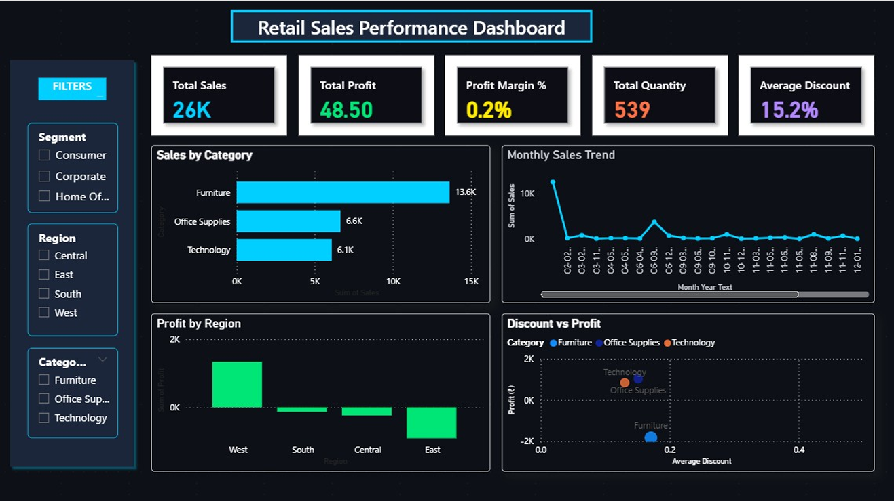
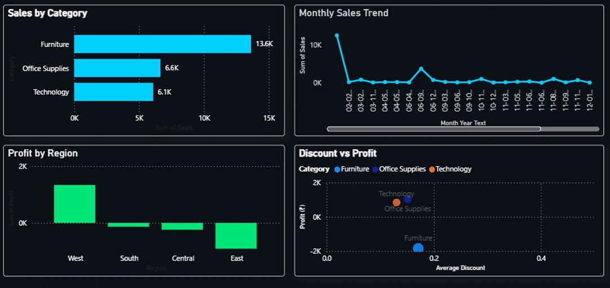
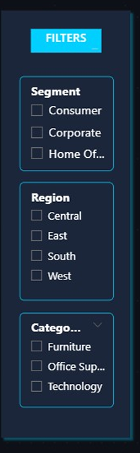

# 📊 Retail Sales Performance Dashboard  
### Power BI | MySQL | DAX | Data Analytics

This project is an end-to-end Retail Sales Analytics Dashboard built using **Power BI**, with **MySQL** as the backend database.  
It analyzes sales, profit, discount patterns, and customer trends using the Superstore dataset.

---

## 📈 Dashboard Preview

### **Full Dashboard**

### **KPIs**

### **Charts**

### **Filters Panel**

---

## 🚀 Project Highlights
- Modern **dark-themed dashboard** with clean UI  
- Left-side **interactive filter panel** (Segment, Region, Category)  
- MySQL used for **data import & preprocessing**  
- Custom **DAX measures** for KPI metrics:
  - Total Sales  
  - Total Profit  
  - Profit Margin %  
  - Total Quantity  
  - Average Discount  
- Visuals include:
  - Bar Chart – Sales by Category  
  - Line Chart – Monthly Sales Trend  
  - Scatter Plot – Discount vs Profit  
  - Map – Sales by State  
  - Bar – Profit by Region  

---

## 🛠 Tools & Technologies
- **Power BI** – Dashboard design & visualization  
- **MySQL** – Database & SQL queries  
- **DAX** – KPI measures & calculations  
- **CSV Dataset** – Superstore retail data  

---

## 📁 Project Files
- **Dashboard (.pbix):** Retail_Sales_Dashboard.pbix  
- **PDF Version:** Retail_Sales_Dashboard.pdf  
- **SQL Script:** [mysql_script.sql](mysql_script.sql)  
- **Dataset:** [superstore.csv](data/superstore.csv)  

---

## 📌 How to Use This Project
1. Download the **.pbix file** from this repository  
2. Open it in **Power BI Desktop**  
3. (Optional) Connect to your own **MySQL database**  
4. Click **Refresh** to load updated data  
5. Interact with the dashboard using slicers & filters  

---

## 🎯 Summary
This project demonstrates practical skills in:
✔ Power BI Dashboard Development  
✔ SQL Data Modelling (MySQL)  
✔ DAX Measures  
✔ Data Cleaning & Analysis  
✔ Business Insight Generation  

The dashboard presents a clear understanding of retail operations and sales performance.

---

## 👩‍💻 Author  
**Sujisha**  
Aspiring Data Analyst — Power BI | SQL | Python

